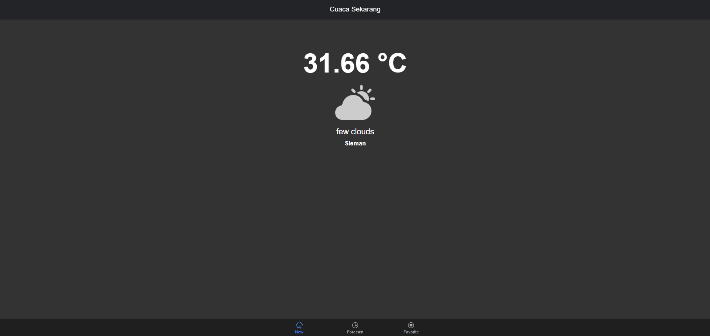

# Weather App

Aplikasi Cuaca sederhana yang dibangun dengan Ionic Framework. Aplikasi ini memungkinkan pengguna untuk melihat kondisi cuaca saat ini dan ramalan cuaca selama lima hari ke depan.

## Fitur

- Menampilkan kondisi cuaca saat ini: suhu, deskripsi cuaca, dan ikon cuaca.
- Menampilkan ramalan cuaca untuk lima hari ke depan.
- Menyimpan lokasi favorit dan menampilkan ramalan cuaca untuk lokasi-lokasi tersebut.

## Cara Penggunaan

1. **Clone Repositori**
    ```bash
    git clone https://github.com/username/weather-app.git
    ```

2. **Install Dependencies**
    ```bash
    cd weather-app
    npm install
    ```

3. **Jalankan Aplikasi**
    ```bash
    ionic serve
    ```

4. **Buka Aplikasi**
    Buka browser dan kunjungi `http://localhost:8100` untuk melihat aplikasi.

## Kontribusi

Saya sangat menghargai kontribusi dari siapa saja! Jika Anda memiliki ide atau perbaikan untuk aplikasi ini, jangan ragu untuk membuka isu atau mengirimkan pull request.

## Tangkapan Layar




## Lisensi

Proyek ini dilisensikan di bawah Lisensi MIT. Lihat `LICENSE` untuk informasi lebih lanjut.
